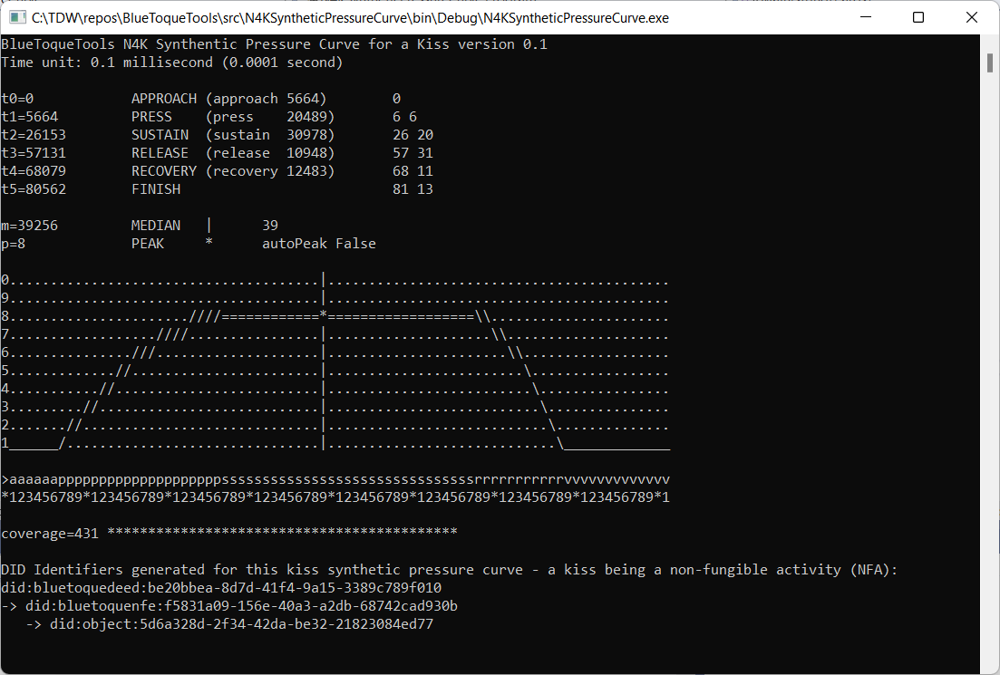

# Trusted Digital Web "BlueToqueTools Non-Fungible Entity (NFE)" Decentralized Identifier Method Namespace Specification version 1.0.0

This DID Method Namespace Specification is a member of the BlueToqueTools Fully Decentralized Object (FDO) Framework specifications.


## 1. Context

### Purpose

The purpose of a DID Method Namespace Specification is to define the following:
- DID Identifier Syntax and Construction
- DID Identifier Query Operators
- DID Document CRUD Abstract Interface(s)
- DID Method Platform Implementation Guidance

The "BlueToqueTools Non-Fungible Entity (NFE)" Decentralized Identifier Method Namespace Specification 
("BlueToqueTools Non-Fungible Entity (NFE)" DID Method Namespace Specification) 
defines the end-to-end lifecycle of DID Identifiers and DID Documents for Non-Fungible Entities, a key feature of the
Fully Decentralized Objects (FDOs) Framework[5][6][V1.2][V1.1], implemented by the Trusted Digital Web[1][7][V1.3][V1.4][V1.5]. 

The "BlueToqueTools Non-Fungible Entity (NFE)" DID Method Namespace is based, in part, on the distinction between 
processsing a _deed_ to an asset vs. a _title_ (the set of claims or rights) conveyed to a subject by the _deed_. 
This DID Method helps to normalize the concepts of:
- an Asset[55a] (e.g. an NFE), 
- a Deed[55b], and 
- a Title. 


Figure 1. N4K Kiss Non-Fungible Activity (Non-Fungible Entity) Example

That is, a Deed is something that conveys Title (a set of claims or rights) to a subject with respect to a specific Asset (or group of Assets)[62].

In addition, the "BlueToqueTools Non-Fungible Entity (NFE)" DID Method Namespace is based, in part, 
on ERC-721 and ERC-1155 NFT specifications[52][53][54]. 

The "BlueToqueTools Non-Fungible Entity (NFE)" DID Method builds upon on a history of experiences with similar 
object specification and data management models; including but not limited to:
- EIP-20: EIP-20: Token Standard[56]
- EIP-721: Non-Fungible Token Standard[53]
- EIP-1155: Multi Token Standard[54]
- NEP-5: Token Standard[57]
- NEP-10: Composite Smart Contracts[58]
- NEP-11: Non-Fungible Token Standard[59]
- StratisPlatform Standard Token[60]
- Smart Contracts in C#: Developers Guide[61]

This specification defines the following:
- "BlueToqueTools Non-Fungible Entity (NFE)" Identifier Syntax and Construction
- "BlueToqueTools Non-Fungible Entity (NFE)" DID Document CRUD Abstract Interface

This specification also provides Platform Implementation Guidance to assist Implementors in creating safe and secure apps, agents, services and platforms
that are compliant with the "BlueToqueTools Non-Fungible Entity (NFE)" DID Method Namespace Specification.

### Out-of-Scope

The following topics are out-of-scope:
- Descriptions of any implementation-specific design, implementation, or deployment details for any particular software platform that might support the "BlueToqueTools Non-Fungible Entity (NFE)" DID Method Namespace.

### Intended Audience

The primary audience for this DID Method Namespace Specification is Implementors of apps, agents, and services on 
the Trusted Digital Web; including but not limited to: 
software architects, data modelers, application developers, services developers, testers, operators, and user experience (UX) specialists. 
In addition, other people involved in a broad range of standards efforts related to decentralized identity,
verifiable credentials, and secure storage may also be interested in reading this specification.

### Terminology

- The term "BlueToqueTools Non-Fungible Entity (NFE)" Identifier is synonymous with the term "BlueToqueTools Non-Fungible Entity (NFE)" Decentralized Identifier. 
- The term "BlueToqueTools Non-Fungible Entity (NFE)" DID Document is synonymous with the term "BlueToqueTools Non-Fungible Entity (NFE)" Decentralized Identifier Document.
- The term "BlueToqueTools Non-Fungible Entity (NFE)" DID Method Namespace Specification is synonymous with the terms "BlueToqueTools Non-Fungible Entity (NFE)" Decentralized Identifier Method Namespace Specification and Trusted Digital Web "BlueToqueTools Non-Fungible Entity (NFE)" DID Method Namespace Specification.
- A compliant Trusted Digital Web Runtime Library is a software library that, in part, implements the "BlueToqueTools Non-Fungible Entity (NFE)" DID Document CRUD Abstract Interface in a way that complies with the "BlueToqueTools Non-Fungible Entity (NFE)" DID Method Namespace Specification.

### Conformance

This specification conforms to the requirements specified in the 
Decentralized Identifiers (DIDs) v1.0 W3C Proposed Recommendation[2] 
published by the W3C Decentralized Identifier Working Group. 

### Authoritative Source Text

The authoriative source text for this specifcation can be found here: https://github.com/mwherman2000/TrustedDigitalWeb/blob/master/specifications/did-methods/did-bluetoquenfe-1-0-0.md.

The list of the most recent versions of this specification can be found here: https://github.com/mwherman2000/TrustedDigitalWeb/blob/master/specifications/did-methods/did-bluetoquenfe.md.

## 2. Trusted Digital Web "BlueToqueTools Non-Fungible Entity (NFE)" Identifier Method Name

The name string that shall identify the "BlueToqueTools Non-Fungible Entity (NFE)" Identifier Method is: `bluetoquenfe`.

A DID Identifier that uses this method **MUST** begin with the following prefix: `did:bluetoquenfe`. 
Per the DID Decentralized Identifier specification[2], the value of this string **MUST** be in lowercase.

## 3. Trusted Digital Web "BlueToqueTools Non-Fungible Entity (NFE)" Identifier Format

There are two different types of "BlueToqueTools Non-Fungible Entity (NFE)" Identifiers on the Trusted Digital Web:
- "BlueToqueTools Non-Fungible Entity (NFE)" schema
- "BlueToqueTools Non-Fungible Entity (NFE)" documents

"BlueToqueTools Non-Fungible Entity (NFE)" Identifiers on the Trusted Digital Web **MUST** use the following format:
```
did-bluetoquenfe-did = "did:bluetoquenfe:" type-string ":" id-string
type-string          = 1* idchar
id-string            = 1* idchar
idchar               = 1-9 / A-H / J-N / P-Z / a-k / m-z 
```
`id-string` is an encoded public key value computed using KERI key management techniques[V2.1][36][37][38].
The KERI seed value can be any globally unique value including, for example, 
a composite database record key, bluetoquenfe key, or GUID value. 
Trusted Digital Web "BlueToqueTools Non-Fungible Entity (NFE)" Identifier `id-string` values are encoded using the KERI `Base64` encoding method.

`idchar` consists of all the characters in the KERI `Base64` character set. 

NOTE: In the following examples, `BF5pxRJP6THrUtlDdhh07hJEDKrJxkcR9m5u1xs33bhp` is an example KERI-based `Base64` id-string`; 
a placeholder `id-string` value.

### Example 1. Trusted Digital Web "BlueToqueTools Non-Fungible Entity (NFE)" Identifier

```
did:bluetoquenfe:kiss:BF5pxRJP6THrUtlDdhh07hJEDKrJxkcR9m5u1xs33bhp
```

### 3.1 DID Identifier Query Operators

This DID Method does not define or support any query operators.

## 4. CRUD Abstract Interface

"BlueToqueTools Non-Fungible Entity (NFE)" Identifiers and associated DID Documents on the Trusted Digital Web are managed by a compliant Trusted Digital Web Runtime Library. 
The Library implements CRUD interfaces for controlling the lifecycle of a "BlueToqueTools Non-Fungible Entity (NFE)" Identifier and its associated DID Document that are compliant with this specification.
 
### 4.1 Create (Register)

To create a "BlueToqueTools Non-Fungible Entity (NFE)" Identifier, a program invokes the `RegIdWithPublicKey` function from a compliant Trusted Digital Web Runtime Library. 
The interface to register a "BlueToqueTools Non-Fungible Entity (NFE)" Identifier and its associated public key is defined as follows:
```csharp
public bool RegIdWIthPublicKey(string didobjectid, byte[] publicKey); 
```
The calling program must include two parameters: the string value of the new "BlueToqueTools Non-Fungible Entity (NFE)" Identifier to be registered and 
a cryptographic public key to act as the first management key. 
This function will return `True` if the "BlueToqueTools Non-Fungible Entity (NFE)" Identifier had not been registered previously.

### 4.2 Read (Resolve)

Trusted Digital Web "BlueToqueTools Non-Fungible Entity (NFE)" Identifier's associated DID Document can be looked up by invoking the `GetDIDDocument` function from a compliant Trusted Digital Web Runtime Library. 
To make sure the result returned by invoking the `GetDIDDocument` function is trustworthy, the client could ask a sufficient number of nodes 
and compare each node's return value.

The interface for resolving a "BlueToqueTools Non-Fungible Entity (NFE)" Identifier and return its associated DID Document is defined as follows:
```csharp
public DIDDocument GetDIDDocument(string didobjectid);
```
A DIDDocument is a JSON object which contains the `verificationMethod`, `authentication` elements of the associated DID Document.
Every public key in the array of `verificationMethod` can be used to authenticate the "BlueToqueTools Non-Fungible Entity (NFE)" Controller.

Note: The list of supported public key signature schemes is listed in [Appendix A](#appendix-a-public-key-algorithm).

### Example 2. Trusted Digital Web "BlueToqueTools Non-Fungible Entity (NFE)" DID Document

```json
{
    "id": "did:bluetoquenfe:BF5pxRJP6THrUtlDdhh07hJEDKrJxkcR9m5u1xs33bhp",
    "verificationMethod": [
        {
            "id": "did:bluetoquenfe:BF5pxRJP6THrUtlDdhh07hJEDKrJxkcR9m5u1xs33bhp#key-1",
            "type": "Ed25519VerificationKey2020",
            "controller": "did:object:1234",
            "publicKeyMultibase": "zEY59y7px76e2yv5FMj9fYcjDsqk8yus6isWtkF69ZrHY"
        }
    ],
    "authentication": ["did:bluetoquenfe:BF5pxRJP6THrUtlDdhh07hJEDKrJxkcR9m5u1xs33bhp#key-1"],
    "assertionMethod": ["did:bluetoquenfe:BF5pxRJP6THrUtlDdhh07hJEDKrJxkcR9m5u1xs33bhp#key-1"],
    "service": [{
        "id":"#agent1",
        "type": "BlueToqueTools.Agent", 
        "serviceEndpoint": "https://agents.example.com/agent1"
    }]
}
```

### 4.3 Update (Replace)

To update the DID Document associated with a "BlueToqueTools Non-Fungible Entity (NFE)" Identifier, two functions need to be invoked, 
```csharp
public bool AddKey(string didobjectid, byte[] newPublicKey, byte[] sender);
```
```csharp
public bool RemoveKey(string didobjectid, byte[] oldPublicKey, byte[] sender);
```
Note that `sender` param must be a currently-in-use public key of this "BlueToqueTools Non-Fungible Entity (NFE)" Identifier.
If a public key is removed, then it **cannot** be added again.

### 4.4 Deactivate (Revoke)

To delete or deactivate a "BlueToqueTools Non-Fungible Entity (NFE)", it suffices to remove all public keys from its associated 
DID Document. In this case, there is no public key that can be used to authenticate the "BlueToqueTools Non-Fungible Entity (NFE)" Controller.

More importantly, deletion of a Trusted Digital Web "BlueToqueTools Non-Fungible Entity (NFE)" DID Document means that the associated "BlueToqueTools Non-Fungible Entity (NFE)" Identifier cannot be reactivated again. 

## 5. Implementation Guidance

The content is this section is non-normative.

Caveat: The applicablility of the individual guidance referenced below to a particular application domain needs to be assessed on a case-by-case basis.

### Security Considerations

There are no security considerations that are specific to this DID Method Namespace Specification. Security considersations and requirements are the responsiblity of the particular platform Implementor - taking into consideration the types of Business Documents, Business Processes, Agents, and Application Objects processed by that platform.

Implementers need to be aware of the security and performance implications of the underlying tools and technologies 
used to develop agents, services, and libraries for the Trusted Digital Web
that, in turn, leverage the "BlueToqueTools Non-Fungible Entity (NFE)" Method Namespace Specification; as one example, whether the underlying VDR is configured to support concensus by PoA, PoS, or PoW 
(Reference: https://academy.stratisplatform.com/Architecture%20Reference/FullNode/Consensus/consensus-introduction.html).

More importantly, Implementers need to be highly aware of the types of Fully Decentralized Objects they are managing and processing on the Trusted Digital Web. 
For example, the security implications of processing an NFT for a kiss are significantly different compared to an international SWIFT-like monetary transfer.

Further, Implementers are strongly encouraged to review the Security Considerations section of the DID Implementation Guide: https://w3c.github.io/did-imp-guide/#security-considerations.

In addition, consult the Security Considerations section of the Decentralized Identifiers (DIDs) (DID-CORE) specification: https://www.w3.org/TR/did-core/#security-considerations.

Lastly, the following list of best-in-class DID Method specifications should also be consulted:

- `did:keri`: https://identity.foundation/keri/did_methods/#security-considerations
- `did:key`: https://w3c-ccg.github.io/did-method-key/#security-and-privacy-considerations
- `did:peer`: https://identity.foundation/peer-did-method-spec/index.html#security-considerations
- `did:tezos`: https://did-tezos.spruceid.com/#security-considerations
- `did:trustblock`: https://github.com/trustbloc/trustbloc-did-method/blob/main/docs/spec/trustbloc-did-method.md#security-considerations
- `did:web`: https://w3c-ccg.github.io/did-method-web/#security-and-privacy-considerations

### Privacy Considerations

There are no privacy considerations that are specific to this DID Method Namespace Specification. Privacy considersations and requirements are the responsiblity of the particular platform Implementor - taking into consideration the types of Business Documents, Business Processes, Agents, and Application Objects processed by that platform.

The syntax and construction of a "BlueToqueTools Non-Fungible Entity (NFE)" Identifier and its associated DID Document helps to ensure that no Personally Identifiable Information (PII) or other personal data is exposed by these constructs.

Implementers need to be aware of the privacy implications of the underlying tools and technologies 
used to develop agents, services, and libraries for the Trusted Digital Web that, that in turn, leverage the "BlueToqueTools Non-Fungible Entity (NFE)" Method Namespace Specification. 

More importantly, Implementers need to be highly aware of the types of Fully Decentralized Objects they are managing and processing on the Trusted Digital Web. 
For example, the privacy implications of processing an NFT for a kiss are significantly different compared to an international SWIFT-like monetary transfer.

Further, Implementers are strongly encouraged to review the Privacy Considerations section of the DID Implementation Guide: https://w3c.github.io/did-imp-guide/#privacy-considerations.

In addition, consult the Privacy Considerations section of the Decentralized Identifiers (DIDs) (DID-CORE) specification: https://www.w3.org/TR/did-core/#privacy-considerations.

Lastly, the following list of best-in-class DID Method specifications should also be consulted:

- `did:keri`: https://identity.foundation/keri/did_methods/#privacy-considerations
- `did:key`: https://w3c-ccg.github.io/did-method-key/#security-and-privacy-considerations
- `did:peer`: https://identity.foundation/peer-did-method-spec/index.html#privacy-considerations
- `did:tezos`: https://did-tezos.spruceid.com/#privacy-considerations
- `did:trustblock`: https://github.com/trustbloc/trustbloc-did-method/blob/main/docs/spec/trustbloc-did-method.md#privacy-considerations
- `did:web`: https://w3c-ccg.github.io/did-method-web/#security-and-privacy-considerations

## 6. Reference Implementations

The current version of the code for the "BlueToqueTools Non-Fungible Entity (NFE)" Identifier Method reference implementation can be found in the following GitHub project: https://github.com/mwherman2000/TrustedDigitalWeb. 
This project is the definitive reference implementation of the Trusted Digital Web "BlueToqueTools Non-Fungible Entity (NFE)" Identifier Method and contains compliant reference implementations of apps, agents, and services deployable on the Trusted Digital Web.

## 7. Acknowledgments

The Trusted Digital Web project would like to thank the DID Specification Registries editors for reviewing,
assessing, and approving this specification for acceptance into the W3C DID Method Registry, https://w3c.github.io/did-spec-registries/.

In addition, the project is very gratefully to all the members of the 
DID-CORE, Verifiable Credentials, and Confidential Storage working groups (hosted by W3C and DIF) for their, literally, years of support.

## Appendix A. Public Key Algorithm

There are three public key algorithms supported in this document. 
1. ECDSA
2. SM2
3. EdDSA

### ECDSA

The curves that can be used are: 

- secp224r1 -- same as nistp224
- secp256r1 -- same as nistp256 
- secp384r1 -- same as nistp384 
- secp521r1 -- same as nistp521

More curves may be supported in future versions of this Method. 

### SM2

There is only one curve that can be used, namely, `sm2p256v1` as defined in [SM2 Digital Signature Algorithm](https://tools.ietf.org/html/draft-shen-sm2-ecdsa-02#appendix-D). 

### EdDSA

There is only one curve that can be used, namely, `ed25519`. 

## Appendix B. Background

NOTE: This Appendix describes the background or context behind the creation of this DID Method Namespace.

The fabric that knits the world together is the Internet global communications network and the World Wide Web (WWW) 
software application that runs on top of the Internet.

The WWW enables individuals, governments, corporations, and other organizations to share, 
consume and interact with a universal sea of data and information representing every aspect of our lives and livelihoods.

The Trusted Digital Web (TDW) is a universal, trusted, frictionless, fully-integrated, standards-based, 
general-purpose, decentralized, end-to-end software and governance platform for global commerce, communication, and collaboration. 
The Trusted Digital Web is envisioned to be the next generation, decentralized, trusted replacement for the World Wide Web.

Every software component in the Trusted Digital Web technology architecture (including every smart contract) is implemented using 
a single programming language and a single common set of tools and technologies:
the C# programming language, Microsoft Visual Studio, and
the cross-platform implementations of the .NET Core Framework and the Microsoft Common Language Runtime (CLR) runtime environment.

Verifiable Data Registry (VDR) support for the Trusted Digital Web is provided by the Stratis Platform[35] - a general-purpose, smart contact-enabled blockchain platform implemented 
using the same programming language, tools and technologies used to implement the Trusted Digital Web.

The Trusted Digital Web includes a Trusted Digital Web Runtime Library that is compliant with the "BlueToqueTools Non-Fungible Entity (NFE)" DID Method Namespace Specification. "BlueToqueTools Non-Fungible Entity (NFE)" Identifiers and the "BlueToqueTools Non-Fungible Entity (NFE)" Identifer Method are two of the components and specifications that are foundational in the architecture and design of the Trusted Digital Web.

The publication of this DID Method Namespace Specification realizes, in large part, a 4-year quest to create a platform to Tokenize Every Little Thing (ELT)[4].


Figure 2. Trusted Digital Web and the Decentralized (DID) OSI Model


Figure 3. Trusted Digital Web (TDW2022) Software Digital Ecosystem

## References

References and historical record of related publications.

[1] Trusted Digital Web: Whitepaper, https://hyperonomy.com/2019/11/06/trusted-digital-web-whitepaper/.

[2] Decentralized Identifiers (DIDs) v1.0 W3C Proposed Recommendation, https://w3c-ccg.github.io/did-spec/.

[3] IETF Internet draft, SM2 Digital Signature Algorithm, https://tools.ietf.org/html/draft-shen-sm2-ecdsa-02.

[4] Tokenize Every Little Thing (ELT), https://hyperonomy.com/2018/01/24/tokenization-of-every-little-thing-elt/.

[5] The Verifiable Economy Architecture Reference Model (VE-ARM): Fully Decentralized Object (FDO) Model, https://hyperonomy.com/2021/04/26/the-verifiable-economy-architecture-reference-model-ve-arm-fdo/.

[6] The Verifiable Economy: Fully Decentralized Object (FDO) Example: Bob’s UDID Document, https://hyperonomy.com/2021/06/15/the-verifiable-economy-fully-decentralized-object-fdo-example-bobs-udid-document/.

[7] Trusted Digital Web: 8-Layer Architecture Reference Model (TDW-ARM), https://hyperonomy.com/2021/06/28/trusted-digital-web-8-layer-architecture-reference-model-tdw-arm/.

[8] DIF SDS/CS WG: CS Refactoring Proposal 0.2 – March 24, 2021, https://hyperonomy.com/2021/03/28/cs-refactoring-proposal/.

[9] Trusted Digital Web: Trusted Content Storage (TCS) Whitepapers, https://hyperonomy.com/2021/03/17/trusted-digital-web-trusted-content-storage-whitepapers/.

[10] Fully Decentralized Twitter (Dewitter) App Scenario: Platform Requirements (presentation to DIF SDS/CS WG – March 18, 2021), https://hyperonomy.com/2021/03/18/fully-decentralized-twitter-dewitter-app-scenario-platform-requirements-presentation/.

[11] TDW Decentralized Glossary Management and Collaboration Platform (TDW Glossary): Digital Identity Neighborhood, https://hyperonomy.com/2021/03/15/tdw-glossary-management-and-collaboration-platform-tdw-gmcp-digital-identity-neighborhood/.

[12] TDW Hub Architecture Reference Model (HUB-ARM) – Version 0.104, https://hyperonomy.com/2021/03/11/tdw-hub-architecture-reference-model-hub-arm/.

[13] Technology Adoption Models: A Comprehensive Guide, https://hyperonomy.com/2019/10/16/technology-adoption-models/.

[14] Is the Social Evolution Model Harmful?, https://hyperonomy.com/2021/02/10/is-the-social-evolution-model-harmful/.

[15] Secure Data Storage Working Group (sds-wg) Confidential Storage (CS): Functional Architecture Reference Models (CS-FARMs) 0.36 (whitepaper placeholder): Sample Diagrams, https://hyperonomy.com/2021/02/10/secure-data-storage-working-group-sds-wg-confidential-storage-cs-functional-architecture-reference-models-cs-farms/.

[16] Trusted Digital Assistant: Conceptual Architecture, https://hyperonomy.com/2021/02/03/trusted-digital-assistant-conceptual-architecture/.

[17] What is SSI?, https://hyperonomy.com/2021/02/01/ssi-unconscious-contractions/.

[18] Trusted Digital Web: First Trusted Web Page Delivered Today – Dec. 3, 2019, https://hyperonomy.com/2019/12/03/trusted-digital-web-first-trusted-web-page-delivered-today-dec-3-2019/.

[19] Trusted Digital Web: Trust Levels for Universal DIDs, https://hyperonomy.com/2019/11/21/trusted-digital-web-levels-of-universal-trust/.

[20] Business Choreography and the #TrustedDigitalWeb, https://hyperonomy.com/2019/04/16/business-choreography-and-the-trusteddigitalweb/.

[21] Social Evolution and Technology Adoption, https://hyperonomy.com/2019/04/08/social-evolution-and-technology-adoption/.

[22] The #OpenToInnovation Principle: Internet protocols and standards not only need to be open, but more importantly, open to innovation, https://hyperonomy.com/2019/03/12/internet-protocols-and-standards-not-only-need-to-be-open-but-more-importantly-open-to-innovation/.

[23] Giving Grammars Written with ABNF Notation the Respect They Deserve, https://hyperonomy.com/2019/03/11/giving-grammars-written-with-abnf-notation-the-respect-they-deserve/.

[24] SerentityData: Variable-byte, Statistically-based Entity Serialization & Field Encoding, https://hyperonomy.com/2019/02/06/serentitydata-variable-byte-statistically-based-entity-serialization-field-encoding/.

[25] #iDIDit: [OLD] An Architecture-driven Taxonomy for SSI Agents v0.5, https://hyperonomy.com/2019/02/01/architecture-driven-taxonomy-for-ssi-agents/.

[26] #iDIDit: What is a DID?, https://hyperonomy.com/2019/01/24/what-is-a-did/.

[27] #iDIDit: [OLD] Hyperledger Indy/Sovrin Comprehensive Architecture Reference Model (INDY ARM) v0.21, https://hyperonomy.com/2019/01/13/hyperledger-indy-sovrin-comprehensive-architecture-reference-model-arm/.

[28] #iDIDit: [OLD] End-to-end Path from a id (DID) to a Real-Life Something v0.3, https://hyperonomy.com/2019/01/04/the-path-from-a-id-did-to-a-real-life-something/.

[29] #iDIDit: What’s more important? …the name of something or the something?, https://hyperonomy.com/2019/01/02/whats-more-important-the-name-of-something-or-the-something/.

[30] DNS (Domain Name Service): A Detailed, High-level Overview, https://hyperonomy.com/2019/01/02/dns-domain-name-service-a-detailed-high-level-overview/.

[31] #iDIDit: [OLD] Decentralized Identifiers (DIDs) Architecture Reference Model (ARM), https://hyperonomy.com/2018/12/21/decentralized-identifiers-dids-architecture-reference-model-arm/.

[32] Refactoring UBL 2.2 business documents for enacting business processes on the blockchain [WIP], https://hyperonomy.com/2018/12/06/refactoring-ubl-2-2-business-documents-for-enacting-business-processes-on-the-blockchain-wip/.

[33] Ethereum .NET Development Examples using the Nethereum Integration Libraries, https://hyperonomy.com/2017/12/19/ethereum-net-examples-using-the-nethereum-libraries/.

[34] #Graphitization of the Amazon Leadership Principles (introducing Personal Leadership Principle Maps) – Iteration 1, https://hyperonomy.com/2017/05/08/amazons-principles/.

[35] Stratis Academy. https://academy.stratisplatform.com/Architecture%20Reference/architecture-reference-introduction.html.

[36] Key Event Receipt Infrastructure - the spec and implementation of the KERI protocol, https://identity.foundation/keri/.

[37] KEY EVENT RECEIPT INFRASTRUCTURE (KERI) DESIGN (whitepaper), https://github.com/decentralized-identity/keri/blob/master/kids/KERI_WP.pdf.

[38] DIF, KERI Project, https://github.com/decentralized-identity/keri.

[39] W3C, Decentralized Identifiers (DIDs) (DID-CORE) specification: https://www.w3.org/TR/did-core/.

[40] OMG, Business Process Model and Notation (BPMN), https://www.omg.org/spec/BPMN/2.0/PDF.

[41] OASIS, Universal Business Language Version 2.2 (UBL), http://docs.oasis-open.org/ubl/UBL-2.2.html.

[42] Trinity Graph Engine open source project, https://www.graphengine.io/.

[43] Trinity Graph Engine GitHub repository, https://github.com/Microsoft/GraphEngine.

[44] Object Linking and Embedding (OLE), https://en.wikipedia.org/wiki/Object_Linking_and_Embedding.

[45] Component Object Model (COM) https://en.wikipedia.org/wiki/Component_Object_Model.

[46] Open Database Connectivity (ODBC), https://en.wikipedia.org/wiki/Open_Database_Connectivity.

[47] OLE-DB (OLE for Databases), https://en.wikipedia.org/wiki/OLE_DB.

[48] Active Data Objects for .NET (ADO.NET), https://en.wikipedia.org/wiki/ADO.NET.

[49] MSR, Trinity, https://www.microsoft.com/en-us/research/project/trinity/.

[50] Distributed Component Object Model, https://en.wikipedia.org/wiki/Distributed_Component_Object_Model.

[51] MSDN, OLE Background, https://docs.microsoft.com/en-us/cpp/mfc/ole-background?view=msvc-170.

[52] Non-Fungible Token, https://en.wikipedia.org/wiki/Non-fungible_token.

[53] EIP-721: Non-Fungible Token Standard, https://eips.ethereum.org/EIPS/eip-721.

[54] EIP-1155: Multi Token Standard, https://eips.ethereum.org/EIPS/eip-1155.

[55a] Trusted Digital Web "BlueToqueTools Non-Fungible Entity (NFE)" Decentralized Identifier Method Namespace Specification version 1.0.0, https://github.com/mwherman2000/TrustedDigitalWeb/blob/master/specifications/did-methods/did-bluetoquenfe-1-0-0.md.

[55b] Trusted Digital Web "BlueToqueTools Deed" Decentralized Identifier Method Namespace Specification version 1.0.0, https://github.com/mwherman2000/TrustedDigitalWeb/blob/master/specifications/did-methods/did-bluetoquedeed-1-0-0.md.

[56] EIP-20: Token Standard, https://eips.ethereum.org/EIPS/eip-20.

[57] NEP-5: Token Standard, https://github.com/neo-project/proposals/blob/master/obsolete/nep-5.mediawiki.

[58] NEP-10: Composite Smart Contracts, https://github.com/neo-project/proposals/blob/master/obsolete/nep-10.mediawiki.

[59] NEP-11: Non-Fungible Token Standard, https://github.com/neo-project/proposals/blob/master/nep-11.mediawiki

[60] StratisPlatform Standard Token, https://github.com/stratisproject/StratisSmartContractsSamples/blob/master/src/Stratis.SmartContracts.Samples/Stratis.SmartContracts.Samples/StandardToken.cs.

[61] Smart Contracts in C#: Developers Guide, https://www.stratisplatform.com/wp-content/uploads/2019/07/Stratis-Smart-Contracts-in-C-Smart-Contract-Developer.pdf.

[62] What is a Non-Fungible Token (NFT)? A Deed vs. A Title, https://twitter.com/mwherman2000/status/1465698254981459974

## Video Streams

[V1] Trusted Digital Web Playlist, https://www.youtube.com/playlist?list=PLU-rWqHm5p45dzXF2LJZjuNVJrOUR6DaD.

   1. Using Paper-based Structured Credentials to Humanize Verifiable Credentials [Rough Cut], https://www.youtube.com/watch?v=kM30pd3w8qE&list=PLU-rWqHm5p45dzXF2LJZjuNVJrOUR6DaD&index=1.
   2. Structured Credential Model v0.51 (AKUW Edition), https://www.youtube.com/watch?v=9RLYS7Xvabc&list=PLU-rWqHm5p45dzXF2LJZjuNVJrOUR6DaD&index=2.
   3. Michael Herman | Data Scientist & Blockchain Developer | AIBC Summit, Malta, https://www.youtube.com/watch?v=IuEew7rH5gw&list=PLU-rWqHm5p45dzXF2LJZjuNVJrOUR6DaD&index=3.
   4. TÜBİTAK BİLGEM 2. Ulusal Blokzincir Çalıştayı, Davetli Konuşmacı Michael Herman, Trsuted Digital Web: The Future of the Internet and the World Wide Web, https://www.youtube.com/watch?v=J6n9TvxA93I&list=PLU-rWqHm5p45dzXF2LJZjuNVJrOUR6DaD&index=4.
   5. Trusted Digital Web / Hyperonomy Business Blockchain / NEO-NATION: Annual Report 2019, https://www.youtube.com/watch?v=IAozsIsrlbU&list=PLU-rWqHm5p45dzXF2LJZjuNVJrOUR6DaD&index=5.

[V2] SSIMeetup Webcasts, https://ssimeetup.org/
   1. Key Event Receipt Infrastructure (KERI): A secure identifier overlay for the internet – Sam Smith – Webinar 58, https://ssimeetup.org/key-event-receipt-infrastructure-keri-secure-identifier-overlay-internet-sam-smith-webinar-58/.

## Epilogue

>An Internet specification is like steam (or a horse) - if you don't harness it  and put it to work, its value is marginalized.

- Why is Knowledge like Steam?, https://www.linkedin.com/pulse/why-knowledge-like-steam-michael-herman-toronto-/.
